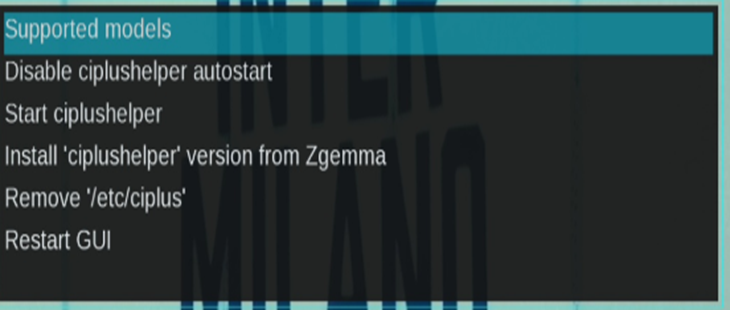
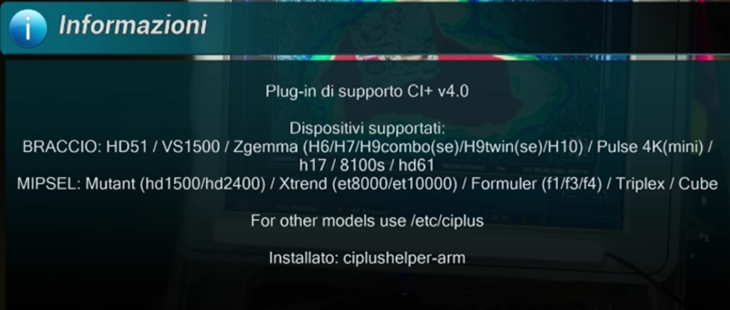
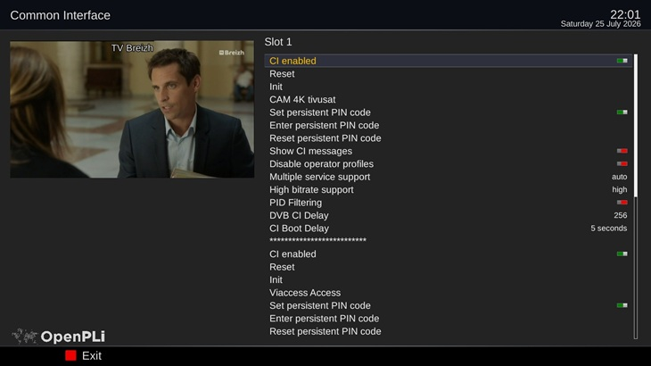

<h1 align="center">⚙️ CI+ Helper Plugin for Enigma2

[](https://github.com/OwnerPlugins/CommandCenter)
[](https://www.enigma2.net)
[](https://www.python.org/)
[](https://github.com/OwnerPlugins/CommandCenter/releases)
[](https://www.gnu.org/licenses/gpl-3.0)
</h1>
<p align="center">
  <a href="https://github.com/Belfagor2005">
    
  </a>
</p>

<p align="center">
  <a href="https://ko-fi.com/lululla">
    
  </a>
  <a href="https://paypal.me/belfagor2005">
    
  </a>
</p>

---

## 📌 Description

**CI+ Helper** is a plugin for Enigma2 that provides comprehensive management of the `ciplushelper` daemon, enabling CI+ certification for a wide range of ARM and MIPSEL set-top boxes.

It automatically detects your box model and architecture, installing the correct binary for optimal compatibility.

---

## ✨ Features

- **Automatic Hardware Detection** – Supports ARM and MIPSEL boxes via `/proc/stb/`, `opkg`, and `uname` fallbacks
- **Multi-Architecture Support** – Separate binaries for generic ARM, Zgemma ARM, and MIPSEL
- **WQHD (2560×1440) Skin** – Optimized interface for 2K displays
- **CI+ Slot Management** – Enable/disable CI+ certification per slot (0 and 1) on ARM boxes
- **Zgemma ARM Binary** – Dedicated binary for Zgemma models (H7, H9, H10)
- **Restart GUI** – Quick restart of Enigma2 interface directly from the plugin
- **Certificates Management** – Install/remove `/etc/ciplus` certificates
- **Autostart Control** – Enable/disable `ciplushelper` at boot
- **Service Control** – Start/stop `ciplushelper` daemon

---

## 📦 Supported Models

### ARM Architecture
- **Zgemma:** H6, H7, H9combo(se), H9twin(se), H10
- **Other:** HD51, VS1500, Pulse 4K(mini), h17, 8100s, hd61, Uclan (ustym4kpro), DM8000

### MIPSEL Architecture
- Mutant (hd1500/hd2400)
- Xtrend (et8000/et10000)
- Formuler (f1/f3/f4)
- Triplex, Cube

---

## 📸 Screenshots

| Main Menu | About | CI+ Slot Management |
|-----------|-------|---------------------|
|  |  |  |

*(Screenshots coming soon)*

---

## 🔧 Installation

### Via Telnet IPK (recommended)
```bash
opkg install /tmp/enigma2-plugin-extensions-ci-plus-helper_6.0_all.ipk
```

or command line

```bash
wget -q --no-check-certificate https://raw.githubusercontent.com/OwnerPlugins/Ciplushelper/main/installer.sh -O - | /bin/bash
```

### From GitHub (development)
```bash
git clone https://github.com/Belfagor2005/ciplushelper-8.4.git /tmp/ciplushelper
cp -r /tmp/ciplushelper /usr/lib/enigma2/python/Plugins/Extensions/
```

### Post-Installation
After installation, **reboot your box**:
```bash
reboot
```

---

## 🚀 Usage

1. Open the **Plugin Browser** (Menu → Plugins)
2. Select **CI+ Helper**
3. Choose from available options:
   - **Start/Stop** ciplushelper service
   - **Enable/Disable** autostart
   - **Install/Remove** `/etc/ciplus` certificates
   - **Install** Zgemma ARM binary (if applicable)
   - **Enable/Disable CI+ slots** (ARM only)
   - **Restart GUI**

---

## 🛠️ Development

### Build from source
```bash
git clone https://github.com/Belfagor2005/ciplushelper-8.4.git
cd ciplushelper-8.4
# Build IPK
opkg-build .
```

---

## 📋 Changelog

### v6.0
- **New:** WQHD (2560×1440) skin support
- **New:** ARM/Zgemma-ARM separation with dedicated binary
- **New:** CI+ slot management (0 and 1)
- **New:** "Restart GUI" command
- **Improved:** Unified hardware detection with multiple fallbacks
- **Improved:** Faster process detection using `pgrep`
- **Improved:** Code refactoring with `commands` dictionary
- **Fixed:** Model detection for boxes without `getImageVersion`
- **Fixed:** Skin dimensions for FHD displays
- **Fixed:** `postrm` script to properly stop service before removal

---

## 📝 Credits

- **Contributors:** Belfagor2005
- **Testers:** Community

---

## 📄 License

This plugin is licensed under the **GNU General Public License v2**.

---

## 🤝 Contributing

Contributions are welcome! Please:
1. Fork the repository
2. Create a feature branch (`git checkout -b feature/amazing`)
3. Commit your changes (`git commit -m 'Add amazing feature'`)
4. Push to the branch (`git push origin feature/amazing`)
5. Open a Pull Request

---

## 📧 Contact

- **GitHub Issues:** [https://github.com/Belfagor2005/ciplushelper-8.4/issues](https://github.com/Belfagor2005/ciplushelper-8.4/issues)
- **Forum:** [https://www.opena.tv/](https://www.opena.tv/)

---

**Enjoy your CI+ Helper!** 🎯


